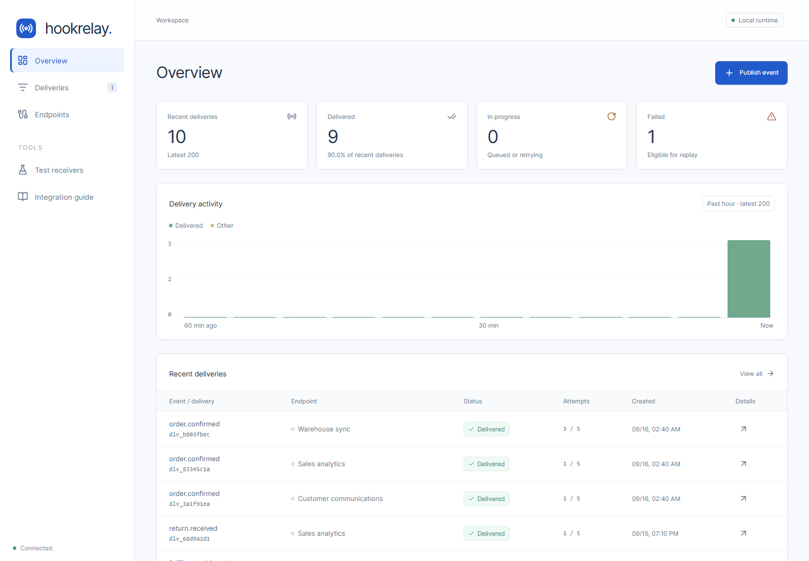

# HookRelay

HookRelay delivers commerce events to the systems that need them. When an order service publishes `order.confirmed`, HookRelay records a delivery for each subscribed endpoint, signs the HTTP request, retries failures independently, and keeps every attempt available for inspection and recovery.

The order service owns checkout and inventory decisions. HookRelay takes over delivery after the event is accepted.



## Try the order flow

Requirements: **Node.js 24.15+** and **pnpm 10**. The application runs locally without Docker, Java, AWS credentials, or third-party accounts.

```bash
pnpm install --frozen-lockfile
pnpm dev
```

For an empty, isolated run, use `pnpm dev:fresh`. It prints the path of a new `.local/run-*` directory. Set `HOOKRELAY_DATA_DIR` to that path to reopen the run; keep its `hookrelay.sqlite` and `master.key` together.

Open the [dashboard](http://localhost:4317) and use **Publish event**. The three seeded endpoints are local HTTP receivers that simulate downstream systems:

| Destination             | Subscribed events                                           | Initial response          |
| ----------------------- | ----------------------------------------------------------- | ------------------------- |
| Customer communications | `order.confirmed`, `fulfillment.shipped`                    | HTTP 200 immediately      |
| Warehouse sync          | `order.confirmed`                                           | HTTP 503 twice, then 200  |
| Sales analytics         | `order.confirmed`, `fulfillment.shipped`, `return.received` | HTTP 503 on every attempt |

An `order.confirmed` event therefore creates three separate deliveries. The communications result does not wait for the warehouse, and the warehouse can recover while analytics remains failed. Open a delivery to see the request and attempt timeline. To recover analytics, set it to **Always accept** in **Test receivers**, then open its failed delivery and select **Replay delivery**. Replay creates a linked delivery; the original failure stays in history.

To observe a lost acknowledgement, set a receiver to **Drop first reply** before publishing a new event. It records one completed action, closes the first connection without replying, and answers the retry with HTTP 200. A repeated delivery ID does not apply the action twice. Manual replay has a new delivery ID and is a separate action in this example.

From a second terminal, `pnpm demo` publishes the same event ID twice. The first request returns **202**; the second returns **200** and creates no new deliveries. A changed payload with the same ID returns **409**. Local failures retry after about 2, 5, 15, and 60 seconds, so the five-attempt failure takes about 83 seconds.

The API runs at `http://127.0.0.1:4310/api`, the test receiver at `http://127.0.0.1:4311`, and persistent state is stored in `.local/hookrelay.sqlite`. For the built dashboard, run `pnpm build` and `pnpm start`, then open `http://localhost:4310`. Stop `pnpm dev` first because both commands use the API port. Port overrides are in `.env.example`; destinations retain their registered URLs if ports change.

## Delivery behavior

- Register endpoints with event subscriptions, individual signing secrets, and pause/resume controls.
- Accept an event and its delivery jobs atomically. Repeated IDs with the same content do not fan out twice.
- Sign outbound requests with HMAC-SHA256; the included receiver verifies the original request bytes.
- Keep independent retry schedules and attempt histories for every recipient. Failed deliveries can be replayed after a destination is fixed.
- Use processing leases and record versions so a stale worker cannot overwrite newer state.

The local runtime uses SQLite and real loopback HTTP. The AWS implementation uses the same core rules with DynamoDB SDK adapters, DynamoDB Streams, SQS, Lambda, API Gateway, Secrets Manager, IAM, and CloudWatch defined in CDK. See the [architecture](docs/architecture.md) for the delivery guarantees and the [AWS runbook](docs/aws-runbook.md) for deployment steps.

## Verify it

```bash
pnpm check                 # TypeScript, ESLint, unit, contract, and HTTP tests
pnpm format:check
pnpm test:flow             # Signed local HTTP, retries, failure, and replay (~90 s)
pnpm build                 # Dashboard and Lambda entry points
pnpm synth                 # Generate CloudFormation without deploying
pnpm verify:synth

# Requires a deployed dev stack and the local AWS profile
AWS_PROFILE=hookrelay pnpm aws:validate
```

Optional DynamoDB SDK integration on **Linux x64** requires `tar` and network access for the first setup:

```bash
pnpm local:setup
pnpm test:integration
```

`local:setup` installs checksum-pinned Eclipse Temurin JRE 17 and the official DynamoDB Local archive under `.local/tools`, which Git ignores. Repeated runs reuse the installed tools. The integration runner finds the project-local Java automatically; no system Java installation or `PATH` change is needed. Tests use fake credentials, a loopback endpoint, and a temporary table. The [verification record](docs/verification.md) separates these checks from an AWS deployment.

## Follow the implementation

| Path                               | Responsibility                                                         |
| ---------------------------------- | ---------------------------------------------------------------------- |
| `packages/core/relay-service.ts`   | Accept events and create deliveries and outbox jobs in one transaction |
| `packages/core/delivery-worker.ts` | Claim jobs, send HTTP, record attempts, and schedule retries           |
| `packages/core/policy.ts`          | Retry timing and limits                                                |
| `packages/core/security.ts`        | Request signatures and signing-secret encryption                       |
| `packages/storage/sqlite-store.ts` | Local transactions, persistence, and queue leases                      |
| `packages/storage/dynamo-store.ts` | DynamoDB SDK storage adapter                                           |
| `packages/delivery/`               | HTTP transport, destination validation, and queue-message schema       |
| `apps/server/`, `apps/receiver/`   | API and controllable local recipient                                   |
| `apps/aws/`, `infra/`              | Lambda adapters and CDK resources                                      |
| `apps/web/src/components/`         | Delivery dashboard and forms                                           |

Start with the [system walkthrough](docs/system-walkthrough.md) to connect the local order flow to the code and AWS services. The [HTTP API](docs/api.md) documents request and signature formats.

## Repository safety

Runtime secrets, local data, AWS CLI files, CDK context, and generated deployment artifacts are excluded from Git. Keep account-specific values in your shell or AWS config, and use placeholders in committed documentation. If a credential is ever committed, revoke or rotate it before cleaning the Git history.

## Current scope

This release operates one workspace with up to 20 endpoints. It has no operator identities, retention policy, pagination beyond the overview limits, or production-volume validation. The AWS backend has been deployed and its managed delivery path validated in a development account. The dashboard is hosted locally; cloud frontend hosting is a separate step. An independently hosted signed receiver, DLQ redrive, and alarm state transitions still need cloud acceptance runs. Development deployments delete their table and secrets with the stack; `stage=production` retains them and enables deletion protection.
