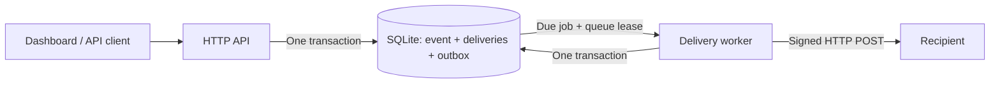
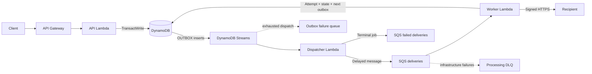
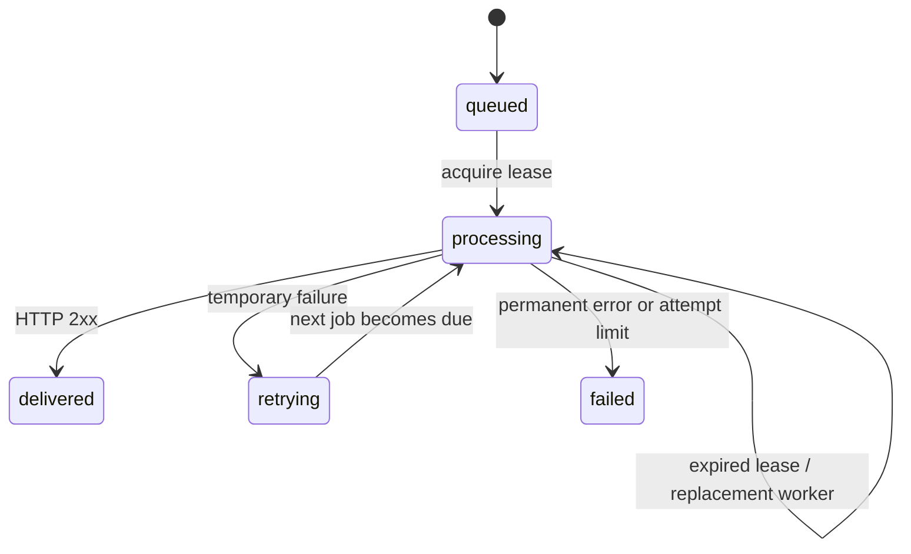

# Architecture and delivery guarantees

## Business records

- **Endpoint:** URL, event subscriptions, active state, encrypted signing secret.
- **Event:** immutable ID, type, data, payload fingerprint, initial delivery IDs.
- **Delivery:** one event sent to one endpoint; state, completed attempt count, next available time, lease.
- **Attempt:** immutable recorded HTTP result and duration. No arbitrary response body is retained.
- **Outbox job:** durable instruction to run an attempt or report a terminal failure.

The code separates domain decisions from storage and HTTP. `RelayService` accepts a `Store` and URL validator. `DeliveryWorker` accepts a `Store`, `Transport`, clock, and master key. Local and AWS adapters execute the same business methods.

## Local path

SQLite outbox records act as the local queue. `BEGIN IMMEDIATE` and a conditional version check make multi-record changes atomic. A due job is leased for 35 seconds. Its delivery has a separate 30-second lease. Crashes leave work visible again after expiry. Acknowledgement is conditional on the queue record version, preventing an old owner from removing replacement work.

## AWS path

Development also creates a separate HTTP API and Lambda receiver that verifies HMAC signatures and produces deterministic 200 and 503 responses for cloud acceptance. It has its own signing secret and is omitted from production.

The API never makes a separate database-write/queue-publish pair. A single DynamoDB transaction commits the event, each delivery, and its first outbox job. Each delivery completion atomically records the attempt, the updated state, and, when needed, its next outbox job. Stream retries can duplicate SQS messages; the delivery ID and expected attempt number make old jobs safe to acknowledge.

Records use `pk = kind`, `sk = id`. The `by-created` index orders recent records. Dashboard queries are explicitly bounded to 200 deliveries and 100 events. Endpoint routing queries use a **strongly consistent primary-index read**, so a newly registered endpoint does not have to wait for index propagation. A versioned endpoint counter enforces the 20-endpoint bound across concurrent registrations.

## Delivery states

HTTP 408, 429, 5xx, DNS failures, connection failures, and timeouts are retryable. Other non-2xx responses, including redirects, are terminal. Five completed HTTP attempts are allowed. Delays are 2, 5, 15, and 60 seconds. `Retry-After` can extend these delays up to 15 minutes. Longer requested waits end the delivery for later manual recovery; the service does not resend earlier than that requested wait.

Pausing an endpoint prevents new event routing to it. Already queued deliveries are marked failed when processed while paused; they can be replayed after activation. An HTTP request already in flight may still finish.

Manual replay creates a new delivery ID linked by `replayOf`. Original attempts remain immutable. The event ID is preserved. Repeating the replay API request creates another explicit replay; clients should avoid automatic retries of that operation without checking the latest history.

## At-least-once delivery

An HTTP receiver can finish its action and then lose its response. A worker can also crash after the receiver acknowledges but before the local transaction commits. In either case the receiver can see the same delivery again. The sender cannot guarantee exactly-once side effects at the recipient.

Receivers should deduplicate `Webhook-Id` atomically with their business action. If an action must remain unique even across manual replays, deduplicate `Webhook-Event-Id` with the appropriate business key too. Distinct events are not ordered by this release.

`attemptCount` counts persisted results. A crash before persistence can cause an additional HTTP request with no recorded result, so this count is not an absolute count of every possible network transmission. The included receiver persists its observed count separately for testing this boundary.

The local test receiver commits one `RECEIVER_EFFECT` record per delivery ID before acknowledging a successful request. In **Drop first reply** mode it commits that record, closes the connection, and answers the duplicate retry with HTTP 200. The record stands in for a business action; real recipients must commit their own action and deduplication key atomically.

## Two kinds of failure

**Recipient failure** is part of normal application processing: commit the outcome and next job, then acknowledge the current SQS message. Exhausted deliveries create a terminal outbox job for the failed-delivery queue.

**Infrastructure failure** prevents the application transaction from completing: return that SQS message ID in `batchItemFailures`. Lambda retries it, and SQS eventually redrives to the processing DLQ. Stream publication failures use partial stream responses and an outbox failure destination. Original outbox rows remain in DynamoDB for repair.

## Security and limits

- Local servers bind to loopback. The API validates Host and Origin and requires JSON for mutations. Local access is trusted to the workstation user.
- AWS API routes require a shared bearer API key. This is a single-workspace operator model, not per-user authorization.
- Production uses two Secrets Manager secrets to separate API access from encryption of endpoint signing keys. Development adds one disposable secret for its validation receiver.
- Destination signing keys use AES-256-GCM at rest. Do not replace the master key without migrating existing ciphertext.
- Public recipients must use HTTPS/443. DNS is revalidated on each attempt; all returned addresses must be public. The socket connects to the validated IP with TLS hostname verification. Redirects are not followed.
- The exact loopback receiver exception exists only in the local runtime.
- Payload limit: 32 KB. Twenty endpoints keep event fan-out within one DynamoDB transaction.
- Retention cleanup and multitenant quotas are not implemented. Development removes data and secrets with the stack. Production retains them and enables DynamoDB deletion protection; see the runbook.

## References

- [Transactional outbox](https://docs.aws.amazon.com/en_en/prescriptive-guidance/latest/cloud-design-patterns/transactional-outbox.html)
- [Lambda with SQS and duplicate processing](https://docs.aws.amazon.com/lambda/latest/dg/with-sqs.html)
- [DynamoDB Streams](https://docs.aws.amazon.com/amazondynamodb/latest/developerguide/Streams.html)
- [SQS per-message delay](https://docs.aws.amazon.com/AWSSimpleQueueService/latest/APIReference/API_SendMessage.html)
